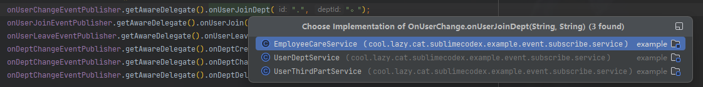
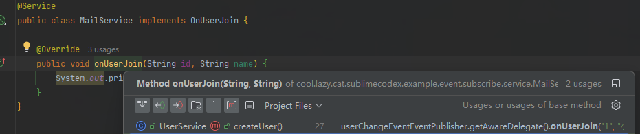

# 前言
工作中经常遇到设计模式应用案例，但我发现大部分开发者并不清楚他所使用的设计模式到底用来解决什么问题，强行应用致使代码畸形，生搬硬套，维护成本很高昂</br>
相比这种拿来当生产实践的做法、为了用而用，很明显是过度设计，因此，笔者根据自己的一些经验之谈，对常见的设计模式进行增强/改造，并提供一些案例，写这篇文章并不是为了炫技，而是它切实的解决了我工作上遇到的问题、痛点，
希望能给更多的开发者以启示，开辟出新的思路，<b>设计模式是工具而非信仰。理解问题本质后，灵活选择或组合模式，才是架构设计的精髓</b></br>

# 1. 事件总线模式
## 1.1 经典事件总线模式实现
如果你熟读八股文，或从网络上检索、咨询AI什么是事件总线，你大概率得到类似这样的代码：
```java
// 事件基类
interface Event {
}

// 事件监听器接口
interface EventListener<T extends Event> {
    void handle(T event);
}

// 事件总线
interface EventBus {
    // 注册监听器
    <T extends Event> void subscribe(Class<T> eventType, EventListener<T> listener);
    // 发布事件
    <T extends Event> void publish(T event);
}
```
它具有鲜明的特点，如：
1. 松散耦合
2. 匿名调用，事件的发起者和订阅者互相无感知
3. 可能无限的订阅关系
4. 允许异步的收发，不严格关心顺序的

事件总线广泛应用于架构层，比如消息中间件，在松散耦合、跨边界通信的场景中，事件总线是更优解。
然而，这些点应用在跨系统调用、架构层面才有意义，如果在jvm内部实现一套事件总线模式，它的这些优点有时候变为了缺点：
1. 事件体统一，只能基于事件本身的类型/对象类型定位订阅者
2. 几乎无耦合，调用链难以追踪

互相匿名，如果你像笔者一样维护过单个事件超过20个发布、订阅的代码，那你大概率能够理解这种方式的弊端


## 1.2 动态代理增强后的事件总线
首先要打破匿名调用的问题，使得事件的发布者和订阅者互相感知到对方的存在，因此采纳动态代理，使用接口建立耦合关系，最合适不过。
### 1.2.1 结构
```java
// 事件感知者 标记接口 无任何方法
public interface EventAware {}

// 事件总线
public interface EventBus {
    /**
     * 发布事件
     * @param awareClass 感知者的接口类型
     * @param action 调用事件函数
     */
    <E extends EventAware> void dispatch(Class<E> awareClass, Consumer<E> action);

    /**
     * 注册事件感知者
     * @param awareInterfaceClass 感知者的接口类型
     * @param aware 关注此事件的对象
     */
    <A extends EventAware> A register(Class<A> awareInterfaceClass, A aware);
}

// 事件发布者
public interface EventPublisher<A extends EventAware> {
    /**
     * <p>获得感知者代理对象</p>
     * <p>不要对这个代理对象使用任何非事件接口方法</p>
     * @return 感知者代理对象，对这个对象进行的方法调用，即等同于对这个事件感知者的所有实现类进行方法调用
     */
    A getAwareDelegate();
}
```
实际上事件的订阅者本身关注的是某个事情的发生时做什么样的一个操作，那么在代码层面，可以理解为某一个方法的执行，就是对某一事件做出的反应。<br/>
那么EventAware本身表示的是一个事件的订阅者，这里我消除掉了事件本身的存在，弱化了事件，把事件本身切换成了某个方法，因此在这个实现方式中，是没有事件体的
### 1.2.2 用法
1. 定义事件感知者
```java
// 入职事件
public interface OnUserJoin extends EventAware {

    void onUserJoin(String id, String name);
}

// 离职事件
public interface OnUserLeave extends EventAware {

    void onUserLeave(String id, String name);
}

// 变更事件
public interface OnUserChange extends EventAware, OnUserJoin, OnUserLeave {

    void onUserJoinDept(String id, String deptId);

    void onUserLeaveDept(String id, String deptId);
}
```
2. 定义事件感知实现类
```java
// 用户-部门关系维护
@Service
public class UserDeptService implements OnUserChange, OnDeptChange {
    // ...
}

// 用户入职时初始化邮箱
@Service
public class MailService implements OnUserJoin {
    // ...
}

// 员工关怀
@Service
public class EmployeeCareService implements OnUserChange {
}

// 同步第三方
@Service
public class UserThirdPartService implements OnUserChange {
}
```
#### 1.2.2.1 标准用法
```java
public void createUser() {
    EventBus.DEFAULT.registerAware(new UserDeptService());
    EventBus.DEFAULT.registerAware(new UserThirdPartService());
    EventBus.DEFAULT.registerAware(new MailService());
    EventBus.DEFAULT.registerAware(new EmployeeCareService());
    // 发布用户入职事件
    EventPublisher<OnUserJoin> onUserJoinEventPublisher = EventPublisher.getPublisher(OnUserJoin.class);
    onUserJoinEventPublisher.getAwareDelegate().onUserJoin("1", "2");
    // 发布用户加入部门事件
    EventPublisher<OnUserChange> onUserChangeEventPublisher = EventPublisher.getPublisher(OnUserChange.class);
    onUserChangeEventPublisher.getAwareDelegate().onUserJoinDept("1", "2");
}
```
#### 1.2.2.2 spring用法
借助IOC容器，自动完成事件感知注册到事件总线，省去EventBus.DEFAULT.registerAware的步骤<br/>
自动完成事件发布器的创建，省去EventPublisher.getPublisher的步骤</br>
因此，只要你具体的事件感知者被加入到了容器中，便可以这样使用：
```java
// 直接按泛型注入
@Resource
private EventPublisher<OnUserChange> onUserChangeEventPublisher;
@Resource
private EventPublisher<OnUserJoin> onUserJoinEventPublisher;
@Resource
private EventPublisher<OnUserLeave> onUserLeaveEventPublisher;
@Resource
private EventPublisher<OnDeptChange> onDeptChangeEventPublisher;

public void createUser() {
    // 发布用户入职事件
    onUserJoinEventPublisher.getAwareDelegate().onUserJoin("1", "2");
    // 发布用户加入部门事件
    onUserChangeEventPublisher.getAwareDelegate().onUserJoinDept("1", "2");
}
```
事件发布者在发布时，便可以看到事件具体的订阅者：<br/>
<br/>
事件订阅者，也可以明确感知到什么时机被调用：<br/>

#### 1.2.2.3 另一种不使用代理的用法
##### 1.2.2.3.1 标准用法
```java
public void createUser() {
    EventBus.DEFAULT.dispatch(OnUserJoin.class, onUserJoin -> onUserJoin.onUserJoin("?", "!"));
}
```
##### 1.2.2.3.2 spring用法
```java
@Resource
private EventBus eventBus;
public void createUser() {
    eventBus.dispatch(OnUserJoin.class, onUserJoin -> onUserJoin.onUserJoin("?", "!"));
}
```
### 1.2.3 spring可选配置
```properties
# 是否自动将事件感知者注册到事件总线中 默认true
sublime-codex.enable-event-aware-auto-registry=true
# 是否自动为事件感知者生成事件发布器 默认true
sublime-codex.enable-event-publisher-auto-registry=true
```
总结：
打破匿名调用，使用代理+接口建立耦合，消除晦涩调用链


# 2.观察者模式
当我完成了动态代理事件总线之后，意外发现这个模式几乎完全替代了观察者模式的能力，已经没有必要再实现一套代理观察者了。


# 3. 泛型工厂模式
工厂是最容易被滥用的模式之一，什么是经典工厂，我就不再赘述了，老生常谈了。<br/>
我这里提供一份泛型工厂的实现，增强工厂的灵活性、易用性，提高扩展能力<br/>
## 3.1 结构
```java
// 原料 标记接口 无任何方法
public interface Material {}

// 加工原料后产出的产品 标记接口 无任何方法
public interface Product {}

// 泛型工厂
public interface GenericFactory<M extends Material, P extends Product> {

    /**
     * 根据原材料生产产品
     */
    P create(M material);
}
```

## 3.2 用法
1. 定义原材料
```java
// 沙子
public class Sand implements Material {
}

// 玻璃 它既是产品(由沙子生产加工得来) 也是原料(用作生产杯子、镜子)
public class Glass implements Material, Product {
}
```
2. 定义产品
```java
// 杯子
public class Cup implements Product {
}

// 镜子
public class Mirror implements Product {
}
```
3. 定义泛型工厂
```java
// 玻璃工厂
@Component
public class GlassFactory implements GenericFactory<Sand, Glass> {
}

// 杯子工厂
@Component
public class CupFactory implements GenericFactory<Glass, Cup> {
}

// 镜子工厂
@Component
public class MirrorFactory implements GenericFactory<Glass, Mirror> {
}
```
### 3.2.1 spring用法
```java
// 以接口 + 泛型类型注入 避免直接按类型注入 尽量减少耦合
@Resource
GenericFactory<Sand, Glass> glassFactory;
@Resource
GenericFactory<Glass, Cup> cupFactory;
@Resource
GenericFactory<Glass, Mirror> mirrorFactory;

public void create() {
    Glass glass = glassFactory.create(new Sand());
    Cup cup = cupFactory.create(glass);
    Mirror mirror = mirrorFactory.create(glass);
}
```

假设定义一个复合工厂，它直接将沙子生产为镜子，实际上内部借助了其他工厂的能力
```java
@Component
public class SandMirrorFactory implements GenericFactory<Sand, Mirror> {
    @Resource
    GenericFactory<Sand, Glass> glassFactory;
    @Resource
    GenericFactory<Glass, Mirror> mirrorFactory;
    
    @Override
    public Mirror create(Sand sand) {
        return mirrorFactory.create(glassFactory.create(sand));
    }
}
```
甚至于工厂的物料和产品也可以是接口而非具体类型，再次排列组合，等等，这比传统的工厂更有趣一些，have fun。


# 使用方式
要求spring boot v2.2.x以上版本, 添加依赖:
```xml
<dependency>
    <groupId>cool.lazy-cat</groupId>
    <artifactId>sublime-codex-springboot-starter</artifactId>
    <version>0.0.1</version>
</dependency>
```


